<p align="center">
  
</p>

# NZ Road Code Master Study & Mock Exam Web Application

[](https://fastapi.tiangolo.com)
[](https://python.org)
[](https://sqlite.org)
[](https://developer.mozilla.org)
[](https://www.chartjs.org)
[](LICENSE)

An interactive, responsive, multi-user web application and consolidated study platform designed for learners preparing for the **Official New Zealand Driver Licence Theory Test** across Class 1 (Car), Class 6 (Motorcycle), and Heavy Vehicles (Classes 2–5).

Powered by **570 verified, semantically deduplicated questions** compiled directly from official Waka Kotahi NZTA guidelines and top driver training datasets.

---

## Visual Showcase & Mockups

### 1. Interactive Study Hub (Desktop & Mobile)
High-density browsing at **100 questions per page** with intuitive circular radio bullets for single-answer questions and square checkboxes for multi-answer questions.

| Desktop Study Hub (100 Qs/Page) | Mobile Study View |
| :---: | :---: |
| 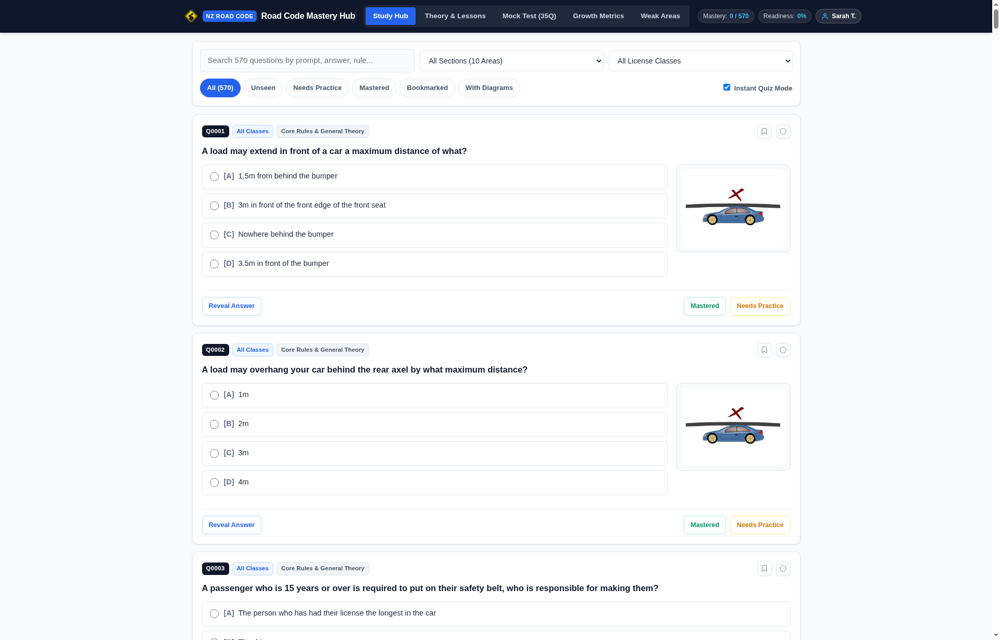 | 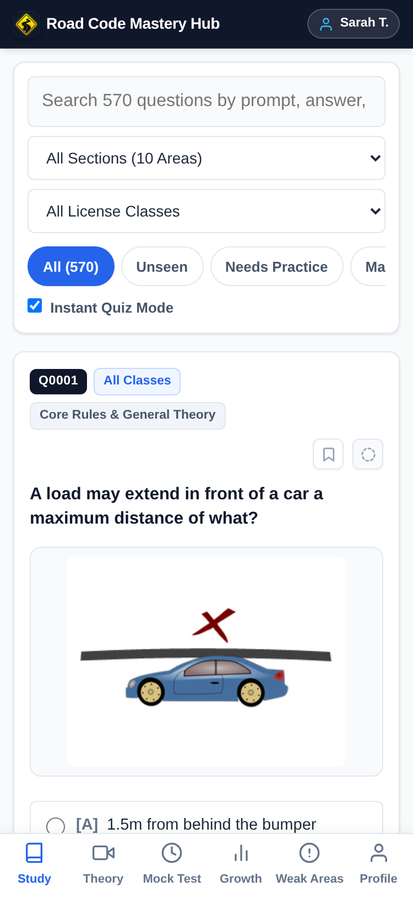 |

---

### 2. Official NZTA Theory Handbook & Drive Go Video Lessons
Dedicated interactive handbook integrating the official New Zealand Road Code across 8 structured chapters alongside all 63 video lessons from the official Waka Kotahi NZTA / ACC Drive Go program.

| Official Theory Handbook Reader | Drive Go Video Lessons Gallery |
| :---: | :---: |
| 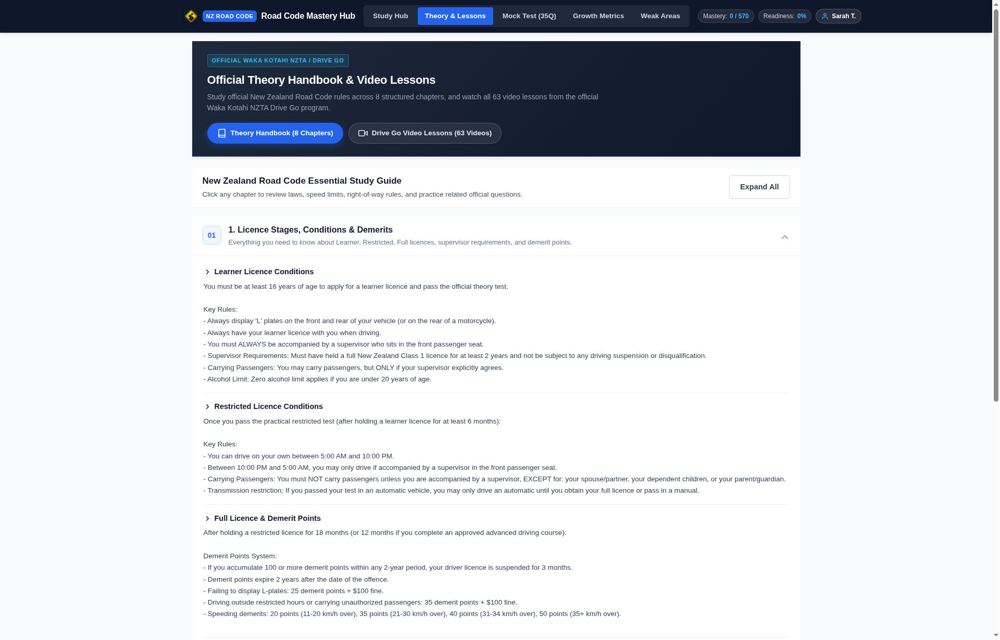 | 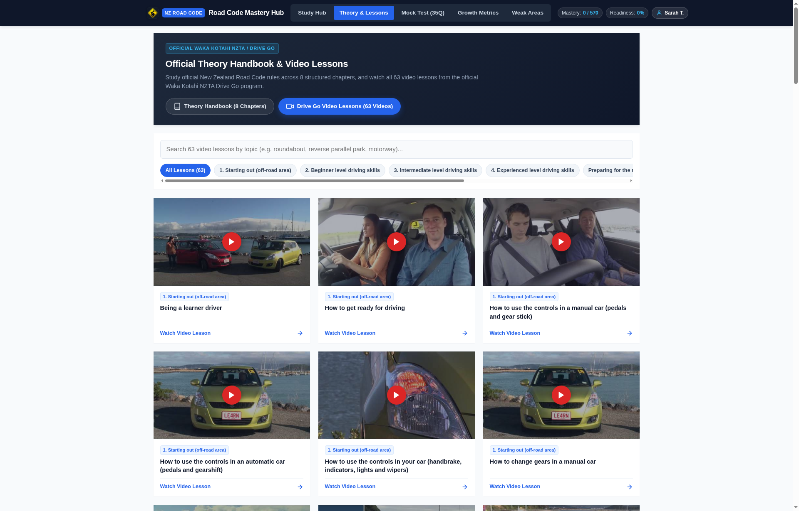 |

| Responsive Video Modal Player | Mobile Theory & Video View |
| :---: | :---: |
|  | 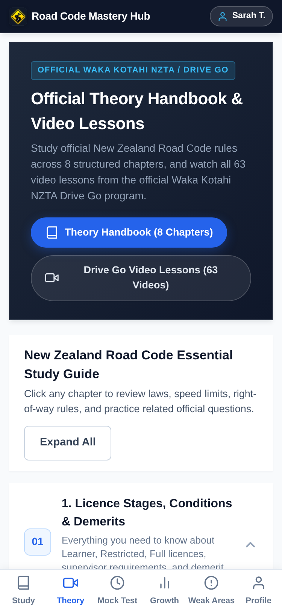 |

---

### 3. Instant Quiz Mode & Answer Feedback
Test recall on the fly with immediate emerald/crimson answer verification, circular selection bullets, and official rule explanations.

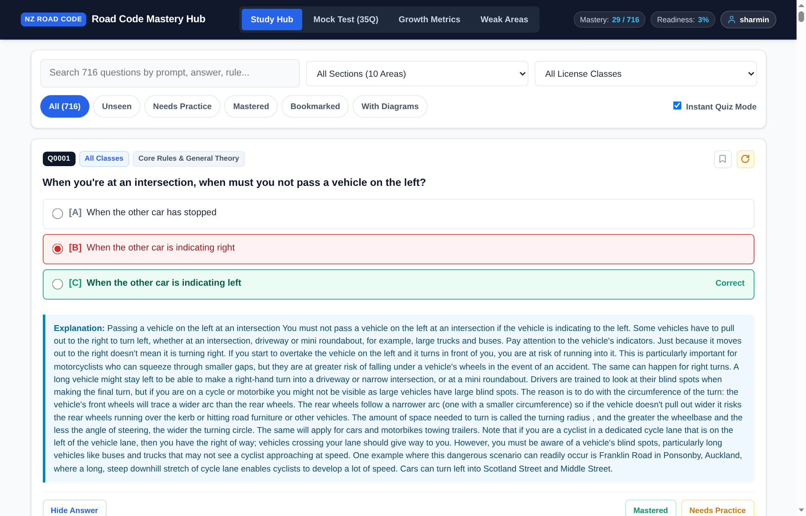

---

### 4. Official 35-Question Mock Exam Simulator
Strict 30-minute countdown timer, official 32/35 (91.4%) pass mark, question flagging, and an interactive 35-item navigation drawer.

| Desktop Exam in Progress | Mobile Exam View |
| :---: | :---: |
| 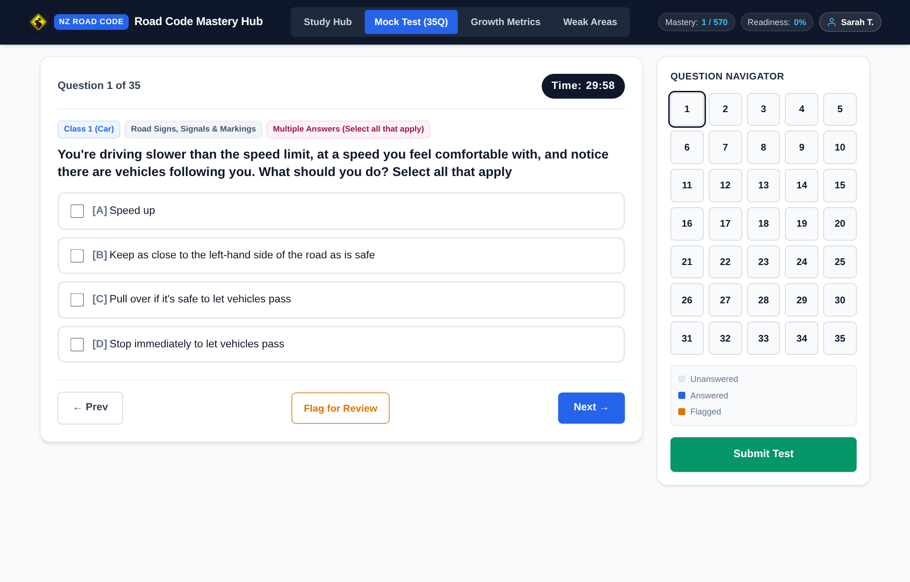 | 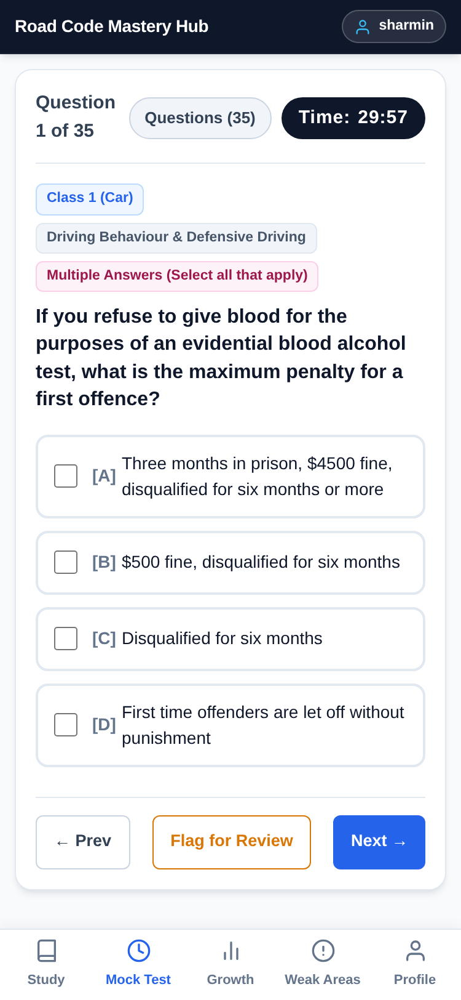 |

---

### 5. Growth Metrics & Weak Areas Diagnostic
Data-driven readiness scoring, score trajectories rendered via Chart.js, and automated isolation of tricky questions.

| Historical Growth Analytics | Targeted Weak Areas Practice |
| :---: | :---: |
| 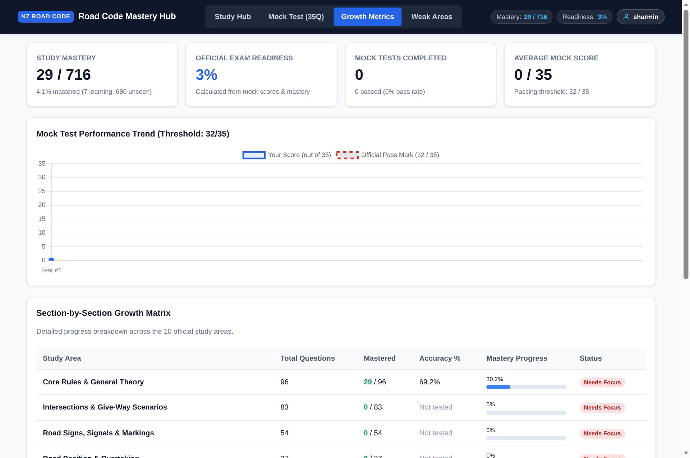 | 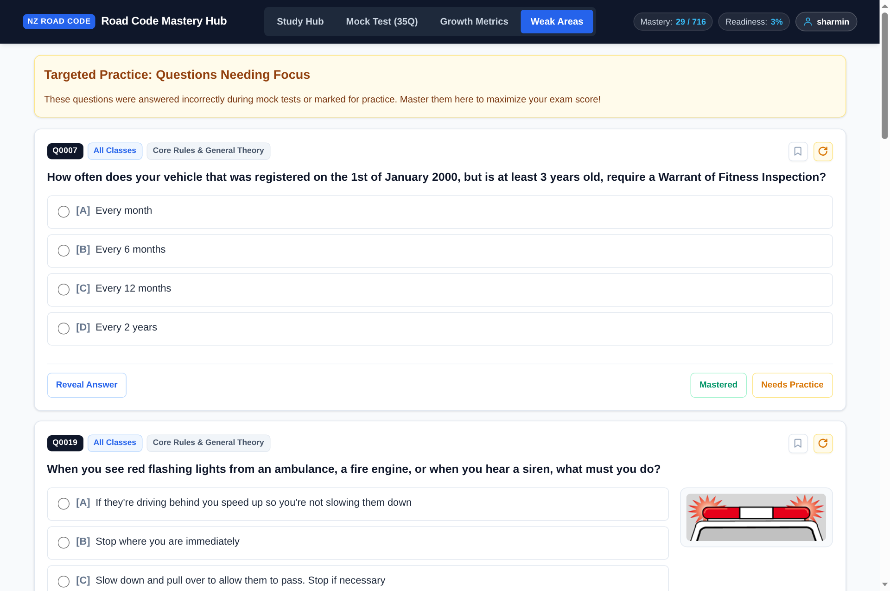 |

---

### 6. Multi-User Authentication Gate
Mandatory sign-in gate featuring learner registration (with email support) and quick-switch profile chips for shared devices.

| Desktop Authentication Gate | Mobile Login Gate |
| :---: | :---: |
| 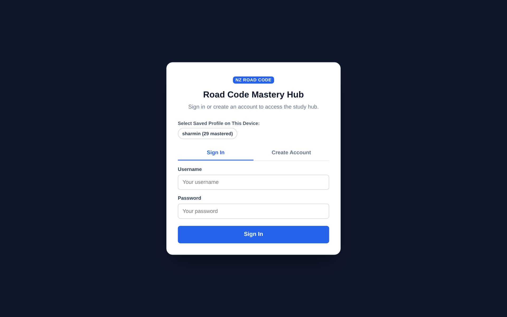 | 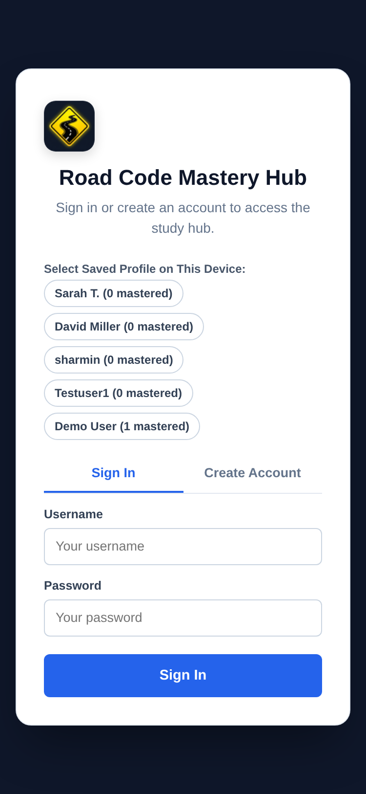 |

---

## Key Features

### High-Density Study Hub
- **100 Questions Per Page**: Organizes the complete 570-question bank across **6 pages** ($\lceil 570 / 100 \rceil = 6$).
- **Simple Pagination Statement**: Clean, unambiguous counter: `Page 1 of 6 (1–100 of 570)`.
- **Intuitive Selection Bullets**:
  - *Single-Choice*: Circular radio bullets (`.study-opt-radio`) aligned before option identifiers (`[A]`, `[B]`, `[C]`).
  - *Multiple-Choice*: Square checkboxes (`.study-opt-checkbox`) with multi-selection support and an explicit "Check Answers" confirmation action.
- **Syllabus Filtering & Live Search**: Filter across all 10 Road Code areas, license types, or mastery state with debounced search.
- **Minimalist Question Cards**:
  - *Status Icons*: Clean SVG icons for Mastered (green checkmark), Needs Practice (amber refresh), and Unseen (dashed circle).
  - *Clean Action Bar*: One-tap bookmark toggle without redundant labels.
  - *Diagram Zoom*: Modal zoom dialogs for high-resolution road diagrams.

### Official NZTA Theory Handbook & Drive Go Video Lessons
- **8 Comprehensive Theory Chapters**: Structured study covering Licence Stages & Demerits, Speed Limits, Give-Way & Intersections, Road Signs & Markings, Stopping & Towing, Vehicle Standards & WoF, Alcohol & Emergencies, and Motorcycle/Heavy Vehicle specifics.
- **63 Waka Kotahi Drive Go Video Lessons**: Complete video catalogue across all 8 official playlists (*Starting out*, *Beginner*, *Intermediate*, *Experienced*, *Test Preparation*, *Common Mistakes*, *Driver Behaviour*, *Coaching Tips*).
- **Responsive In-App Video Modal Player**: Distraction-free embedded player (`youtube-nocookie.com`) with playlist badges, instant category filtering, and direct links to YouTube.
- **Direct Practice Linking**: Jump directly from any theory chapter into practice questions filtered for that topic.
- **Category 11 Dedicated Filter**: Direct Study Hub access to all 42 official NZTA Category 11 Theory questions.

### Official 35-Question Mock Exam Simulator
- **Authentic Proportions**: 35 questions drawn randomly from Core Rules, Intersections, Signs, Parking, and Emergencies matching official NZTA quotas.
- **Official Exam Rules**:
  - 30-minute strict countdown timer.
  - Passing score: **32 / 35 (91.4%)**.
  - Question flagging to mark items for review before submission.
  - Slide-out question navigator tracking answered, unanswered, and flagged items.
- **Post-Exam Review**: Full breakdown showing score by section and question-by-question review with official explanations.

### Weak Area Diagnostic Drill
- Automatically captures questions missed in study sessions or mock exams.
- Focuses practice sessions exclusively on unmastered concepts until conquered.

### Growth Analytics & Readiness Score
- **Readiness Score**: Quantifies exam preparedness based on overall mastery and practice depth.
- **Score Trajectory Chart**: Interactive Chart.js timeline tracking score progression over time against the 32/35 passing threshold.

### Multi-User Support & Profile Switching
- **User Profiles**: Independent study records, mastery tracking, and exam histories per user.
- **Registration**: Supports username, email address, display name, and salted PBKDF2 password hashing.
- **Quick Profile Switcher**: Fast switching between profiles on shared family tablets or computers.
- **Secure Sessions**: 60-day cryptographically generated Bearer tokens with HTTP-only cookie support.

---

## Question Bank Breakdown (570 Canonical Questions)

From an initial pool of **1,279 raw extracted questions**, redundant duplicates were consolidated using semantic answer equivalence, token overlap, and image MD5 diagram verification:

| Section Name | Questions | Topics Covered |
| :--- | :---: | :--- |
| **Motorcycle Specific (Class 6)** | **136** | Protective gear, pillion passengers, stability, and motorcycle roadcraft. |
| **Intersections & Give-Way Scenarios** | **83** | Priority rules, roundabouts, T-intersections, and traffic light signals. |
| **Core Rules & General Theory** | **80** | General road rules, speed limits, legal duties, and vehicle standards. |
| **Heavy Vehicles & Commercial Driving (Classes 2–5)** | **80** | Gross vehicle mass, load securing, logbooks, work-time rules, and height limits. |
| **Driving Behaviour & Defensive Driving** | **74** | Scanning, hazard perception, alcohol/drug limits, fatigue, and phone laws. |
| **Road Signs, Signals & Markings** | **45** | Compulsory, warning, and information signs; road markings and light signals. |
| **Road Position & Overtaking** | **28** | Passing lanes, lane positioning, motorway driving, and following distances. |
| **Emergencies & Road Safety** | **26** | Crash procedures, breakdowns, emergency vehicles, and hazard management. |
| **Parking & Stopping Restrictions** | **15** | Broken yellow lines, pedestrian crossings, clearways, and parking bans. |
| **Tourist & Driving in NZ Preparation** | **3** | NZ road orientation, driving on the left, and rural driving precautions. |
| **Total Master Knowledge Base** | **570** | **100% deduplicated, verified official question bank.** |

---

## Architecture & Directory Structure

```text
nz-dirving/
|-- LICENSE                      # MIT Open Source License
|-- README.md                    # Project master documentation (with visual mockups)
|-- .gitignore                   # Excludes binaries, APKs, and production databases
|-- docs/
|   `-- screenshots/             # High-resolution desktop and mobile snapshot mockups
|-- webapp/                      # Full-stack interactive study application
|   |-- README.md                # Web application architecture and API reference
|   |-- server.py                # FastAPI endpoints, auth middleware, and static serving
|   |-- database.py              # SQLite3 migrations, user auth, and progress operations
|   |-- study_tracker.db         # Local development SQLite database
|   |-- run.sh                   # Dev launch script
|   `-- static/
|       |-- index.html           # Single Page Application entry point
|       |-- css/
|       |   `-- style.css        # Responsive styling and CSS animations
|       `-- js/
|           |-- app.js           # Client state management, DOM rendering, and API fetch
|           `-- chart.min.js     # Chart.js library for performance graphs
`-- export/                      # Datasets, extraction scripts, and print materials
    |-- README.md                # Dataset documentation
    |-- nzta_theory_guide.json   # 8 comprehensive official NZTA theory chapters
    |-- drive_go_videos.json     # 63 official Waka Kotahi Drive Go video lessons
    |-- master_unique_questions.json  # 570 canonical deduplicated questions (JSON)
    |-- master_1279_questions.json    # 1,279 raw extracted questions
    |-- nz_road_code_master.html      # Print-ready HTML with embedded CSS Paged Media
    |-- NZ_Road_Code_Master_Unique_Questions_Print_Friendly.pdf # 104-page master PDF (570 questions)
    `-- NZTA_Official_Road_Code/      # Official Waka Kotahi source diagrams & data
```

---

## API Reference

All protected endpoints require an `Authorization: Bearer <session_token>` header or `session_token` cookie.

### Authentication Endpoints
| Method | Endpoint | Description | Auth Required |
| :--- | :--- | :--- | :---: |
| `POST` | `/api/auth/register` | Register new profile (`username`, `email`, `display_name`, `password`) | No |
| `POST` | `/api/auth/login` | Authenticate with username/email and password | No |
| `POST` | `/api/auth/logout` | Terminate session and invalidate session token | Yes |
| `GET` | `/api/auth/me` | Fetch authenticated user summary, mastery count, and readiness | Yes |
| `GET` | `/api/auth/users` | List public profile summaries for device quick switcher | No |

### Official Theory & Video Endpoints
| Method | Endpoint | Description | Auth Required |
| :--- | :--- | :--- | :---: |
| `GET` | `/api/theory/guide` | Retrieve 8 comprehensive NZ Road Code theory study chapters | No |
| `GET` | `/api/theory/videos` | Query 63 official Drive Go video lessons with category filter | No |

### Study & Question Endpoints
| Method | Endpoint | Description | Auth Required |
| :--- | :--- | :--- | :---: |
| `GET` | `/api/questions` | Query question bank with pagination, search, and topic/status filters | Yes |
| `GET` | `/api/questions/{id}` | Retrieve individual question detail and user progress | Yes |
| `POST` | `/api/questions/{id}/answer` | Validate answer choice and record attempt in study tracker | Yes |
| `POST` | `/api/questions/{id}/status` | Manually update question status (`learning` / `mastered`) | Yes |
| `POST` | `/api/questions/{id}/bookmark` | Toggle question bookmark status | Yes |
| `GET` | `/api/images/{image_id}` | Serve question road diagram image | No |

### Mock Exam & Analytics Endpoints
| Method | Endpoint | Description | Auth Required |
| :--- | :--- | :--- | :---: |
| `GET` | `/api/test/generate` | Generate 35-question mock exam based on official topic distribution | Yes |
| `POST` | `/api/test/submit` | Grade mock exam, compute section breakdowns, and save session | Yes |
| `GET` | `/api/test/history` | Retrieve past mock exam records for current user | Yes |
| `GET` | `/api/test/session/{id}` | Fetch full question and answer details for a historical exam | Yes |
| `GET` | `/api/weak-areas` | Query questions needing practice based on historical mistakes | Yes |
| `GET` | `/api/metrics` | Retrieve comprehensive learning metrics and score timelines | Yes |
| `POST` | `/api/reset` | Permanently reset study progress and test records for current user | Yes |

---

## Getting Started

### Prerequisites
- Python 3.10 or higher
- `pip` package manager

### Local Development Setup
```bash
# Clone the repository
git clone https://github.com/mosfaqur/nz-driving.git
cd nz-driving/webapp

# Install required dependencies
pip install fastapi uvicorn pydantic

# Launch the development server (port 8080)
python3 server.py --host 0.0.0.0 --port 8080
```
Open **`http://localhost:8080`** in your browser.

---

## Production Deployment (Systemd Service)

The web application runs in production under `systemd` with automatic restart on reboot or failure.

### Service Configuration (`/etc/systemd/system/nz-driving.service`)
```ini
[Unit]
Description=NZ Road Code Study & Mock Exam Web App
After=network.target
Documentation=https://github.com/mosfaqur/nz-driving

[Service]
Type=simple
User=root
WorkingDirectory=/opt/nz-driving/webapp
Environment=PYTHONUNBUFFERED=1
Environment=TZ=Pacific/Auckland
ExecStart=/usr/local/bin/uvicorn server:app --host 0.0.0.0 --port 8011 --workers 2
Restart=always
RestartSec=5
StandardOutput=journal
StandardError=journal
SyslogIdentifier=nz-driving

[Install]
WantedBy=multi-user.target
```

### Managing Service Execution
```bash
# Check status
systemctl status nz-driving.service

# Restart service after pulling updates
systemctl restart nz-driving.service

# Monitor live journal logs
journalctl -u nz-driving.service -f
```

---

## License

This project is licensed under the [MIT License](LICENSE).
Road Code question data and diagrams are compiled from public Waka Kotahi NZTA resources for educational and learner preparation purposes.
